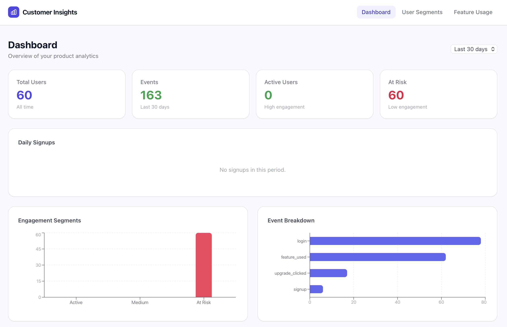
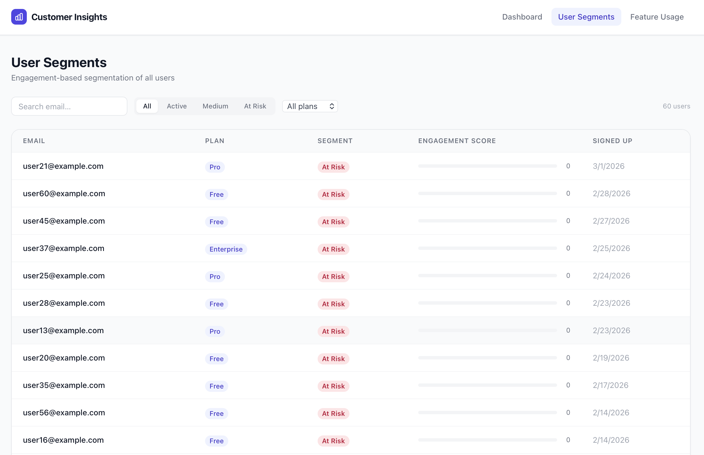
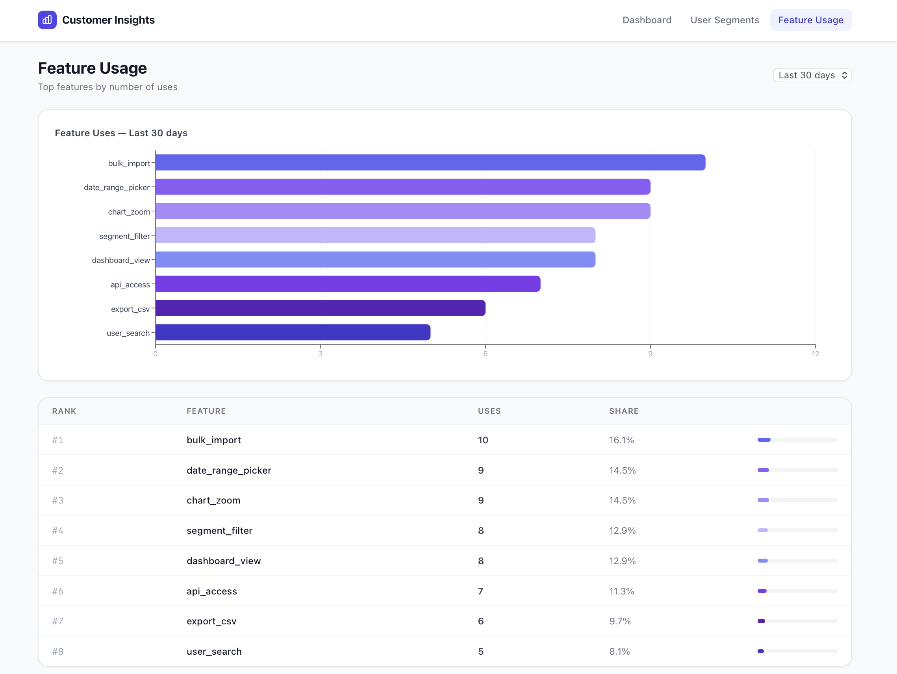

# Feature Usage & Customer Insights Dashboard


A mini SaaS analytics tool — think simplified Mixpanel/Amplitude — built with latest frontend and backend frameworkd. 

## Features

| Area | What's built |
|------|-------------|
| **Backend** | UserProfile, Event, Feature models · Engagement scoring · Segmentation (Active / Medium / At Risk) |
| **API** | `POST /api/events/` · `GET /api/dashboard/metrics/` · `GET /api/users/segments/` · `GET /api/features/top/` |
| **Dashboard** | Daily signups line chart · Engagement distribution bar chart · Event breakdown |
| **User Segments** | Filterable table by segment & plan · Engagement score bar |
| **Feature Usage** | Horizontal bar chart · Usage share table |

## Architecture

```
React (Vite + Tailwind + Recharts)
          ↓  /api/*  (proxied in dev, nginx in prod)
Django REST Framework
          ↓
SQLite (dev) / PostgreSQL (prod / Docker)
```

## Getting started (local dev)

### Backend

```bash
cd backend
python -m venv .venv && source .venv/bin/activate
pip install -r requirements.txt
cp .env.example .env
python manage.py migrate
python manage.py seed_data          # loads 60 users + 400 events
python manage.py createsuperuser    # optional: Django admin
python manage.py runserver
```

### Frontend

```bash
cd frontend
npm install
npm run dev
```

Open **http://localhost:5173**

## Docker (full stack)

```bash
cp backend/.env.example backend/.env
docker compose up --build
```

| Service | URL |
|---------|-----|
| App | http://localhost:5173 |
| Django API | http://localhost:8000/api/ |
| Django Admin | http://localhost:8000/admin/ |

## API reference

| Method | Endpoint | Description |
|--------|----------|-------------|
| `POST` | `/api/events/` | Track an event |
| `GET` | `/api/dashboard/metrics/?days=30` | Dashboard metrics |
| `GET` | `/api/users/` | List users |
| `GET` | `/api/users/segments/?segment=Active&plan_type=pro` | Segmented users |
| `GET` | `/api/features/top/?days=30` | Top features by usage |

## Engagement scoring

```
score = Σ events in last 7 days
        where feature_used events count ×2

Active   → score ≥ 10
Medium   → score ≥ 3
At Risk  → score < 3
```

## Application Preview

### 📊 Dashboard
Real-time analytics of user activity
<p align="center">
  
</p>

### 👥 User Segments
Engagement-based segmentation of all users
<p align="center">
  
</p>

### ⚙️ Feature Usage
Top features by number of uses and their ranking
<p align="center">
  
</p>

## Author

Haseeb Ahmad (Fullstack Developer)
